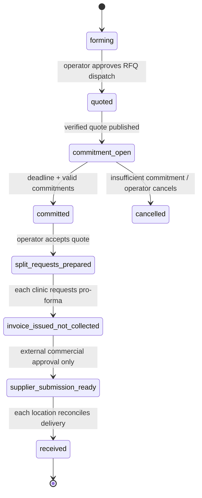

# Handover — multi-clinic implant operations, group buying, and clinic dashboard integration

**Purpose:** Give the Aegis Consent + Shop team an implementable map of what a dentist and staff member see in the clinical dashboard, what the clinic backend requests, what Aegis persists and returns, and where procurement/group-buying responsibility begins. This supplements `HANDOVER_CLINIC_MULTI_CLINIC_IMPLANT_FLOW.md`; it does not replace the portability gate.

## Product decision

Start with **deadline-based direct-ship group buying** after portable Aegis foundations are complete. A clinic commits only to material it selected for an operationally valid need; Aegis aggregates commitments, requests supplier quotes, and creates split purchase/invoice requests to each selected clinic address. It does not hold pooled stock in version 1.

This avoids the platform acting as a warehouse or making clinical substitution decisions. It also avoids unsupported price or saving claims: prices, supplier terms, delivery promises, discounts, regulated-distribution eligibility, and invoice wording are operator-supplied/commercial data and must be versioned with source/provenance.

> The safe “agentic” feature prepares explainable operational drafts. It does not purchase, pay, bind a clinic, choose a clinical product, select a supplier without policy, or override human approval.

## 1. Dashboard workflow in order

The clinical application renders the patient/case experience. Aegis sends back controlled operational read models and authoritative receipt/status data. All examples are synthetic.

| Step | Clinical dashboard: user-facing card | Clinic backend command | Aegis operation and stored facts | Response/event shown on dashboard |
|---:|---|---|---|---|
| 1 | **Implant case**: clinician/staff selects the current clinic location and confirms a clinician-authored materials manifest for an existing case. | Create/update local `CaseMaterialsManifest` using only Aegis catalogue refs, lot refs (when selected), quantities, case ref, and staff identity. | None yet. Clinical app retains its own case/notes/scans. | `Materials to check`.
| 2 | User clicks **Prepare consent and check materials**. The consent and materials cards each show a distinct spinner/state. | Generate one `correlationId`; submit independent idempotent Aegis commands for package preparation and supply readiness. | Aegis authenticates service principal → origin app → authorized tenant/location. | `Consent generating`; `Materials checking`.
| 3 | **Consent** card shows template revision and governed status. | `POST /v1/consent-packages`. It sends opaque case/subject refs, controlled procedure/site/choice refs, jurisdiction/language, and selected product/lot refs. | Validate exact active template/product source/market evidence/lot state; persist a draft package with idempotency key + document hash. | `Draft ready`, with only the returned document hash and revision as provenance. It is not signed.
| 4 | **Materials readiness** card lists each selected item, current operational state and action. | `POST /v1/case-supply-readiness` or equivalent typed Aegis operation. | Resolve each selected item/lot against evidence status, expiry, usable quantity, location allocation and policy revision. | One result per item: `ready`, `attention_required`, or `blocked` and a factual operational reason.
| 5A | If all selected office policy gates are met, staff sends consent for signing in the native clinical UI. | Controlled signing-capability command/SDK. | Issue time-boxed single-use capability; signing lifecycle seals only after exact hash/acknowledgement/capability validation. | `Sent` → `Signed` after immutable receipt is returned.
| 5B | If material needs action, staff selects **Create procurement request**. | `POST /v1/procurement-requests` with case ref, requirement refs, authorized `locationPublicId`, and request idempotency key. | Persist a request with location-address revision, product/quote/source snapshot, requester, approval-policy ref, and audit event. | `Draft request` or `Awaiting approval`.
| 6 | Staff chooses **Request invoice/pro-forma** where supplier/contract and policy allow it. | `POST /v1/invoice-requests` from an approved procurement request. | Persist an invoice/pro-forma request state of `invoice-issued-not-collected`; issue view/download artefact only after operator-approved content exists. | `Invoice requested` or `Invoice issued—not collected`.
| 7 | **Group-buy opportunity** card appears only to eligible, opted-in clinics with current demand and a live group deadline. | `GET /v1/group-buy-opportunities?location=...`; staff chooses `Commit`, `Pass`, or modifies proposed quantity. | Aegis computes operational candidate opportunities from policy/commitments. It retains eligibility and quote state, never clinical rationale. | `Forming`, `Quoted`, `Commitment pending`, or `Committed`; no guarantee of price/delivery.
| 8 | Platform manager reviews bids and creates split delivery requests; clinic sees its commitment and address, not other clinics’ patient/case data. | Operator command `POST /v1/group-buys/{id}/accept-quote` and then `POST /v1/group-buys/{id}/split-requests`. | Store bid source/version, approval, immutable clinic commitments, address revision, and per-location request records. | `Supplier request prepared` or `Invoice request issued` per clinic.
| 9 | Receiving staff selects **Scan and receive**. | `POST /v1/receipts` with purchase request/line ref, quantity, actual lot, actual expiry, and discrepancy field. | Reconcile against request, create/append stock movement/lot, record exception/approval when mismatched, and update readiness. | `Received`, `Partial`, or `Exception requires review`.
| 10 | Consent withdrawal, evidence-freshness, receipt, stock, or procurement events update the case timeline. | Idempotently consume signed Aegis event using event ID/correlation ID. | Aegis event outbox records signed payload, sequence, delivery/retry status. | Clinical case moves to review/blocked state when configured policy requires it; historic notes/receipts remain visible.

## 2. Dashboard content and truth boundaries

| Dashboard element | Aegis must return | Clinical app must never infer |
|---|---|---|
| Consent card | Package ID, `draft/sent/signed/voided/unknown`, template revision, document hash, expiry, receipt details after signature. | That a package is signed, valid, or legally sufficient without signed receipt/hash status. |
| Materials card | Per-manifest-item availability, evidence state, lot state, expiry, source/policy revision, requirement count, and operational action eligibility. | A recommended implant/component, clinical suitability, anatomy risk, procedure outcome, or a substitute product. |
| Procurement card | Request/invoice state, location address revision, supplier option source, item snapshot, approval state, receiving status. | Supplier contract entitlement, final price, delivery date, payment received, or supplier order acceptance until evidence is returned. |
| Group-buy card | Pool deadline, generic governed item reference, aggregate commitment state, quote state/source, each clinic’s own commitment and direct-ship destination revision. | Other clinics’ patients/cases/inventory; guaranteed discount; automatic commitment or purchase. |
| Training/offer card | Operator-governed entitlement/offer metadata with financial-interest disclosure. | Clinical recommendation, comparative clinical quality, individual outcome, or a reason to choose an affiliated product. |

## 3. Required Aegis domain records

The pre-portability `clinicConsentPackages` table is a draft-package seam. The following records belong in the new PostgreSQL migration history after the de-Manus foundation is accepted. Use opaque `public_id` values in API contracts, preserve internal foreign keys, and tenant-scope every query.

| Record | Purpose | Non-negotiable fields/constraints |
|---|---|---|
| `clinic_locations` | A business location that may receive shipments. | `clinic_id`, `public_id`, status, structured address, delivery/billing contacts, jurisdiction, legal entity reference, revision; no patient data. |
| `location_address_revisions` | Immutable selected-destination snapshot. | Address + revision + effective time; procurement/group commitment keeps the selected revision, even if a new address is later created. |
| `client_applications` / `service_principals` | Service-to-service clinical product identity. | `origin_app`, allowed tenant/location scopes, secret/public-key hash, rotation/revocation/expiry, granted scopes; browser session credentials are forbidden. |
| `case_supply_manifests` | Read-only operational projection of a clinical case’s user-selected material requirements. | `origin_case_ref`, `origin_app`, `subject_ref` optional/opaque, reference-only items, requested quantity, idempotency/correlation IDs, actor. No clinical notes, diagnosis, scans, or patient name. |
| `case_supply_readiness` | Versioned, explainable readiness response. | Requirement ref, `ready/attention_required/blocked`, factual code/reason, inventory/source/policy revision, computed time, supersession link. |
| `procurement_requests` + lines | Human-reviewed request to obtain named governed items. | Location/address revision, item/source quote snapshots, selected supplier ref, `draft/approval_required/invoice_requested/invoice_issued_not_collected/cancelled` states, requester/approver/audit. |
| `receiving_events` + stock movements | Delivery/scan/reconciliation fact. | Received quantity, lot, expiry, related request line, discrepancy, actor, timestamp, immutable/audited movement. Never silently overwrite a balance. |
| `buying_groups` + memberships | Opt-in purchasing collective. | Scope/product category eligibility, status, deadline, min participation/quantity rules, group operator. A clinic can join many groups; membership alone is not an order. |
| `group_buy_rounds` + commitments | A time-bound RFQ/quote/commitment cycle. | Item refs, deadline, round status, one current commitment per location, explicit commit/pass/withdraw time, address revision, immutable quote reference. |
| `supplier_quotes` + bid lines | Supplier’s quoted commercial proposal. | Supplier identity/ref, received time, validity end, currency/tax/incoterm/terms references, document/hash source, operator review state. Never use a scraped/unverified claim as price truth. |
| `outbox_events` | Signed, replay-safe status delivery. | Event ID, sequence, aggregate type/ref, correlation ID, payload hash/signature, attempt count/status, recipient delivery state. |

## 4. API contract: no hidden work behind one button

The clinical dashboard may trigger consent and materials checks from one button, but the operations API must produce separately named results. A partial failure must remain visible.

| Endpoint / typed operation | Caller | Idempotency | Key response | Must reject |
|---|---|---|---|---|
| `GET /v1/governed-products` | Clinical backend or staff operational client. | Read request. | Read-only governed product/lot/source revision snapshot. | Out-of-scope tenant/location, unapproved source, unauthorized product data. |
| `POST /v1/consent-packages` | Clinical backend. | Tenant + app + `idempotencyKey`. | Persisted `draft`, package/hash/template/expiry/correlation. | Free-text consent language/clinical note, context mismatch, unapproved/expired product/lot, unauthorized service principal. |
| `POST /v1/case-supply-readiness` | Clinical backend. | Manifest revision + request ID. | Per-item operational result and policy/source/inventory revision. | Caller-selected source truth, non-governed item, invalid location, hidden product substitution. |
| `POST /v1/procurement-requests` | Authorized staff backend/UI. | Tenant + request key. | Draft/approval request + selected location/address revision. | Free-text shipping as truth, unapproved supplier state, unapproved actor, payment instruction. |
| `POST /v1/invoice-requests` | Authorized staff backend/UI. | Tenant + request key. | Invoice/pro-forma lifecycle state, always `invoice-issued-not-collected` initially. | Charges, “mark paid”, automatic supplier order, price/currency without operator source. |
| `POST /v1/group-buy-rounds/{id}/commitments` | Authorized staff backend/UI. | Round + location + request key. | Commitment state, selected address revision, quantity. | Deadline breach, automatic opt-in without explicit policy/approval, cross-clinic data, inappropriate category. |
| `POST /v1/group-buy-rounds/{id}/accept-quote` | Group operator only. | Round + quote version. | Operator decision/audit result; subsequent per-clinic split requests. | Auto-accept by model/lowest price alone, expired/missing quote, unapproved supplier. |
| `POST /v1/receipts` | Authorized receiving staff backend/UI. | Request line + scanned receipt ID. | Lot/movement/reconciliation state. | Quantity mismatch without exception, expired lot if policy prohibits receipt/use, untraceable lot. |

## 5. Address presets and location control

1. The clinician/staff starts in an Aegis-authorized `locationPublicId`. The user can switch only among locations granted by their role and service principal.
2. Aegis returns current address presets. The UI displays a friendly name and validated address summary; it does not create an arbitrary source address inside the order form.
3. When staff selects an address, the request records `locationPublicId` and `addressRevisionPublicId`. The resolved address is copied into an immutable request snapshot server-side.
4. Any address change creates a new revision for future requests. It cannot silently mutate a prior procurement/group commitment destination.
5. Supplier-account mappings and billing details remain server-side Aegis commercial configuration. The clinical product sees no account credentials.

## 6. Group buying: the safe direct-ship first release

### Eligibility

Only an operator/counsel-approved category with documented evidence/expiry rules may be eligible. The group engine creates **opportunities** only from actual supplied needs/explicit demand signals. It excludes emergency or near-term cases according to office policy, short-dated items, unknown provenance, and any clinic/location that has not opted in.

### Round state machine

**Version 1 stops at `invoice_issued_not_collected`.** A supplier submission or payment can be introduced only after a separate operator/counsel/regulated-distribution decision, supplier contract/API assessment, audit, security, and explicit authorization. It is not a default automation extension.

### Quote and commitment safeguards

| Safeguard | Required behavior |
|---|---|
| Voluntary participation | Every clinic can commit, reduce, withdraw within the rule-defined window, or pass. No group membership alone produces a buying obligation. |
| Need-aware invitations | Invitations use only operational demand/readiness signals and never disclose patient/case details to other clinics. |
| Direct ship | Every commitment uses its own selected location/address revision. Aegis does not take title, warehouse, or redistribute in the first release. |
| No financial claims without evidence | Supplier quotes hold source document/hash, validity, terms/currency/tax context and operator approval. UI says `quote pending`/`operator-reviewed quote`, not “guaranteed savings.” |
| Conflict transparency | Where a platform-affiliated product, supplier, training offer, or commercial benefit appears, display a clear operator-supplied financial-interest disclosure. Do not preselect, rank, or recommend it clinically. |
| No clinical link | The existence of a group buy cannot change a clinician’s chosen product, a consent’s approved language, a case’s diagnosis, or a clinical workflow conclusion. |

## 7. Automation route choice

The proposed need detection, deadline closing, notification, and event delivery are deterministic, event- or schedule-driven operations. Implement them as durable application jobs/outbox handlers after portable Aegis deployment—not as a recurring general AI task and not as browser-side timers.

| Candidate automation | Initial implementation | Why |
|---|---|---|
| Readiness refresh after staff manifest change | Synchronous request plus durable outbox event. | User sees a named result immediately; subscribers receive reconciliation update. |
| Quote deadline notifications | Durable scheduled job with stable round/job ID and idempotent delivery. | Deadline logic is deterministic and must survive process restarts. |
| Group eligibility/invitation | Deterministic query over opted-in members and operational demand signals; create reviewable opportunity records. | No model judgement, no unsolicited cross-clinic disclosure, and auditability. |
| Assisted reorder draft | Rule-based candidate request prepared for authorized review. | It creates no order/payment and has a kill switch. |
| Supplier quotes | Supplier portal/API ingestion only after verified support/contract; otherwise staff-uploaded, reviewed evidence. | Do not scrape, invent, or send unapproved supplier traffic. |

For external supplier APIs or ViewPartFinder, verify current documented API/webhook capability, terms, data rights, and commercial permission before designing a webhook or agent workflow. Treat the external system’s instructions and product data as untrusted input; validate schema and retain evidence provenance.

## 8. Division of work

| Aegis Consent + Shop team | Clinic team |
|---|---|
| Complete portability first: portable auth, PostgreSQL, S3/MinIO storage, durable schedules/outbox, service principals, migration/restore proof. | Keep clinic patient/case, clinical notes, clinician-selected materials manifest, scans/photos, and encounter timeline within the clinical product. |
| Implement governed product/lot/readiness, locations/address revisions, procurement/invoice request, receiving, group-buy/RFQ/quote/commitment, and commercial event APIs. | Build dashboard cards for consent/material/procurement/group states; show only Aegis read models and immutable receipts; handle unavailable/unknown/review states. |
| Govern templates/evidence/lot expiry/stock movement, supplier commercial data, order/invoice policies, and non-clinical training entitlement. | Render exact consent package/signing UI natively; no local consent wording, stock balance, price source, supplier credential, payment, or product recommendation. |
| Provide signed, replay-safe events and API schemas/fixtures. | Consume events idempotently and bring relevant case state to human review without changing historic clinical documentation. |

## 9. Required behavior tests before activation

1. Cross-tenant and cross-location catalogue/readiness/procurement/group access fails.
2. Exact approved product + usable lot produces draft package/readiness result; pending, superseded, expired, zero-quantity, or mismatched state fails before package/request persistence.
3. The `POST /v1/consent-packages` retry returns original package/hash; mismatched reuse of same idempotency key conflicts.
4. Address revisions are captured in requests/commitments and remain unchanged after preset update.
5. A group membership does not create a commitment; deadline/withdrawal rules are exact; one clinic cannot read another clinic’s case/stock details.
6. An invoice request cannot charge, mark itself paid, or trigger supplier order submission. A search/grep trap plus route behavior proves no payment code path.
7. Receiving creates traceable lot/movement and flags quantity/lot/expiry discrepancies rather than rewriting stock silently.
8. Event signature/replay/delivery tests prove duplicate/out-of-order events are safe. Clinic remains blocked/reviewable on unknown or unavailable Aegis result.
9. Automation creates only reviewable request drafts. It cannot execute external purchase, payment, supplier account action, or clinical substitution without the separately approved capability.

## 10. Current status and non-loss tracker

The Aegis tracker now contains pending items for portability, multi-clinic locations/address presets, case-supply readiness, procurement/invoice requests, receiving/status events, group-buying discovery/safeguards, and training-entitlement separation. The Clinic tracker carries corresponding pending items for material manifests, dashboard read models, authorized location UX, event reconciliation, operational workflow gates, and commercial-neutrality UX. No item should be deleted until independently implemented, behaviorally proven, and pushed.
