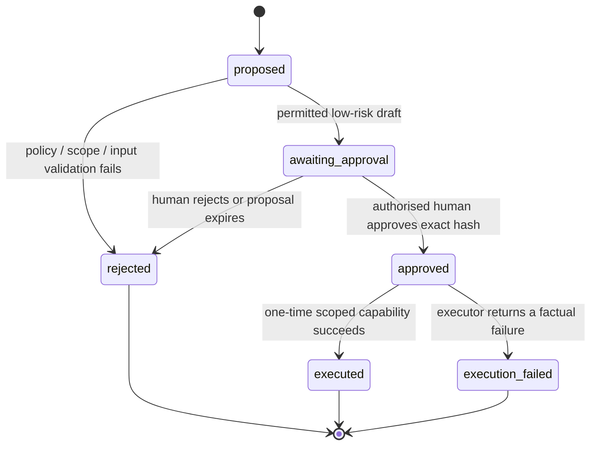

# Aegis future operations architecture: agents, paper signing, languages, and group procurement

**Status:** Design record and implementation gate. This document defines a controlled future direction. It does not activate an agent, create a payment capability, make a regulatory assertion, or permit supplier ordering.

## 1. Product boundary

Aegis remains usable as a **standalone clinic workspace**. A clinician or authorised staff member can create a governed consent, review its source-linked content, issue it for electronic signing, retain immutable records, and produce a printable document without connecting a separate clinical application. The future Clinic integration is an additional controlled channel, not a prerequisite or a replacement for standalone operation.

| Capability | Standalone Aegis | Future clinical-application integration | Source of truth |
|---|---|---|---|
| Consent assembly | Staff chooses a governed template, site, materials, lots, and language in Aegis. | Clinical application sends only controlled references to Aegis. | Aegis template, source, lot, and audit records. |
| Clinical context | Staff enters only information accepted by the controlled Aegis form. | Patient names, diagnosis, notes, scans, images, and plan prose remain in the clinical application. | Clinical application. |
| Signing | Aegis manages its native patient review and signing flow. | Aegis issues a future controlled signing capability; the clinical application renders the approved native signing experience. | Aegis sealed record and receipt. |
| Printing | Staff prints the exact reviewed draft or sealed signed PDF with a version/hash reference. | Clinical application may render an Aegis-issued printable artefact and receipt reference. | Aegis document artefact. |
| Procurement | Staff creates a non-binding draft, approval request, or invoice/pro-forma request. | Clinical application requests the same states using controlled location and material references. | Aegis operational ledger. |

> **Boundary:** The clinical product owns clinical assessment and treatment planning. Aegis owns consent governance, source and material traceability, operational stock facts, and approved non-clinical procurement records. Neither a model nor a purchasing rule may select a clinical product or determine treatment suitability.

## 2. Provider-neutral operational agent

An operational agent may be useful for drafting explanations, searching **approved internal** operational records, preparing a proposed inventory request, or opening an approval task. It must be a replaceable provider behind the Aegis policy gateway—not a privileged actor with direct database, consent-signing, payment, or supplier-order access.

xAI’s current function-calling documentation describes a model requesting a tool call while the application executes the function and returns the result. This supports a safe division of responsibility: an optional Grok-powered agent can propose a typed action, while Aegis independently validates scope, records the action, and requires human approval before consequential work proceeds. [1]

| Layer | Required responsibility | Explicitly prohibited |
|---|---|---|
| Conversation provider | Turn a user request into a structured **proposal**. Grok/xAI may be one provider; it is not embedded in core workflow logic. | Directly call supplier, payment, signing, database-write, or clinical-decision APIs. |
| Aegis policy gateway | Validate user identity, clinic/location scope, reference-only arguments, capability allow-list, rate limit, and policy revision. | Trust model-supplied permissions, clinical facts, source evidence, or prices. |
| Action ledger | Persist immutable proposal, tool-call request, validation decision, approver, final outcome, timestamps, and hashes. | Store provider API credentials, unredacted diagnosis/scan text, or unnecessary patient content. |
| Human approver | Review a clear action summary, affected clinic/location, evidence provenance, and expiry before approval. | Approve a blank, altered, expired, cross-tenant, or non-explainable request. |
| Executor | Run only the exact approved capability once and return an auditable receipt. | Expand scope, make substitutions, silently retry a consequential command, or create payment/order commitments. |

### 2.1 Agent action state machine

The eventual `agentActionLedger` record must include an opaque action public ID, tenant and location references, requesting human identity, provider label/model/version, prompt-input classification (not raw confidential prompt text by default), requested capability, canonical argument hash, policy revision, approval deadline, approver identity, execution receipt hash, event sequence, and tamper-evident predecessor hash. Any edit creates a new proposal; it never changes a prior entry.

| Capability class | Example | Initial treatment | Human approval requirement |
|---|---|---|---|
| Read-only operational lookup | “Show usable lots for this exact governed product.” | Return factual, tenant-scoped records only. | None beyond authenticated access. |
| Draft preparation | “Prepare a request-invoice draft for three units.” | Create an uncommitted Aegis draft. | Required before any state escalation. |
| Notifications | “Prepare a message to the procurement owner.” | Present a preview and recipient scope. | Required before external send. |
| Clinical consent assembly | “Choose an implant based on this scan.” | Block. | Never agent-authorised. |
| Signing / witnessing | “Sign the consent for the patient.” | Block. | Never delegated to agent. |
| Supplier order / price choice / payment | “Order the cheapest compatible product.” | Block. | Not enabled until a separate commercial and technical approval programme exists. |

### 2.2 Agent-provider decision

No provider is selected today. A provider evaluation must cover contractual data use, regional processing, auditability, tool-call schemas, rate limits, incident response, key rotation, retention controls, and whether model/provider terms permit the intended commercial workflow. Grok/xAI can be evaluated as a candidate because it supports structured tool requests, but it must not determine policy or receive a general-purpose credential. [1]

## 3. Printable and physical-signature workflow

Aegis already treats a signed record as immutable. The future paper path must extend that model rather than presenting a paper scan as an editable replacement.

| Stage | Required record | Immutable control |
|---|---|---|
| Print preparation | `printPackage` with consent draft revision, document hash, template/source/material snapshot references, generated-at time, and print copy number. | The printed artefact displays its package ID and hash/verification URL or code. |
| Physical signing | Staff confirms that a patient signed the exact printed package; optional witness identity and signing place/time are captured under the clinic’s configured policy. | The confirmation is an appended event linked to the print package, not an update to the document. |
| Scan/retention | Scanned paper image/PDF is quarantined, malware-checked, access-controlled, and stored as a reference with a content hash. | The scan is evidence of a physical artefact; it does not overwrite the original render or source snapshot. |
| Verification | Aegis compares the asserted print package hash/version to the sealed record and reports `matched`, `not_matched`, or `requires_review`. | A mismatch blocks any “verified paper signature” claim and opens a review task. |

The workflow must be **jurisdiction-policy configured**. A clinic administrator and local counsel determine whether paper signing is permitted, required, witnessed, and/or scanned for each jurisdiction and procedure type. Aegis must not infer a country’s legal signature requirement or label a consent legally sufficient. The current electronic sign path and the future physical-signature event must remain visibly distinct in records and exports.

## 4. Governed multilingual expansion

Current production content supports only the language versions already evidenced by a canonical source and approved template. Malta is currently designed as English-only until exact reviewed source and template content exists. No translation feature may turn an English document into a patient-ready legal or clinical consent automatically.

| Content element | Future data requirement | Approval gate |
|---|---|---|
| Locale | BCP 47 locale (for example `en`, `pl`, future `mt`) plus jurisdiction and reading-direction metadata. | Clinic/counsel language policy. |
| Template translation | Parent template revision, translator/reviewer identities, provenance, change summary, and independent language revision. | Administrator plus designated human clinical/legal review. |
| Product disclosure translation | Exact canonical source language, translated block, source locator/page/section, translator/reviewer attestations, and version mapping. | Canonical source and language-specific administrator approval. |
| Patient rendering | Exact locale, fallback decision, and applied template/source versions within the draft/signed snapshot. | No silent fallback from an unavailable patient language to a different approved language. |
| Agent assistance | Optional non-patient-ready translation draft, clearly watermarked as pending review. | Must never bypass the reviewed translation workflow. |

If the requested patient language has no approved template or source disclosure, the consent builder must fail closed and tell staff to select an available governed language or complete the review workflow. A patient can be given a translated explanatory aid only when the clinic’s policy permits it; that aid cannot substitute for the governed consent record.

## 5. Inventory-aware group procurement—future direct-ship programme

The group-buy concept can be valuable for non-urgent, pre-approved operational demand, but it introduces commercial, privacy, tax, distribution, and contractual risks. The first viable model is **deadline-based, direct shipping to each clinic**. Aegis does not warehouse pooled stock, take title to medical/dental materials, infer supplier eligibility, or share participant patient/case information.

| Control area | Required v1 rule |
|---|---|
| Eligibility | Operator and counsel approve an eligible product category, evidence/expiry requirements, jurisdiction, and permissible supplier route. Emergency or near-term need, short-dated stock, unknown provenance, and non-opted-in locations are excluded. |
| Demand signal | A request comes from a controlled material requirement or an authorised stock policy. The group engine stores no diagnosis, patient name, clinical note, or image. |
| Participation | Membership and auto-opt-in preference never create an order commitment. A clinic explicitly commits, changes quantity, passes, or withdraws within the configured window. |
| Commercial data | Supplier quote, terms, price, tax, currency, discount, validity, and delivery information require operator-entered or verified supplier-origin evidence with a version/hash. No scraped or model-generated price is presented as truth. |
| Fulfilment | Aegis creates a separate direct-ship procurement or invoice request for each clinic/location address revision. No pooled payment, warehousing, title transfer, or automatic supplier submission is permitted in v1. |
| Privacy | A clinic sees only its own commitment, destination revision, and group-level aggregate state. It never receives another clinic’s inventory, patient, case, or supplier-account data. |
| Commercial neutrality | An affiliated product, supplier, or training benefit carries an operator-approved financial-interest disclosure and is never ranked or recommended clinically. |

### 5.1 Deferred records and events

Future implementation should introduce `buyingGroups`, `buyingGroupMemberships`, `groupBuyRounds`, `groupBuyCommitments`, `supplierQuotes`, `quoteLines`, and signed/replay-safe `outboxEvents`. Commitment and quote lifecycle records need immutable versioning, explicit deadline checks, policy revision, authorised operator decision, and per-clinic address revision. Aegis must stop at `invoice_issued_not_collected` until supplier integration, commercial policy, payment controls, counsel review, and explicit operator approval are all completed.

## 6. Activation gates

| Future capability | Minimum activation evidence |
|---|---|
| Agent proposal service | Provider due diligence, scoped credentials outside database records, policy gateway, immutable action ledger, kill switch, approval UI, red-team tests, and no privileged tool bypass. |
| Physical-signature verification | Jurisdiction policy configuration, print-package hashing, append-only witnessed event, secure scanned-document pipeline, and mismatch/review tests. |
| New patient language | Exact canonical content, language-specific template/disclosures, named human translation and review attestations, jurisdiction policy, and snapshot rendering tests. |
| Group buying / RFQ | Counsel/operator-approved programme, supplier commercial evidence, privacy review, direct-ship address revision model, commitment/withdrawal state machine, no-payment trap tests, and durable jobs/outbox in a portable runtime. |
| External supplier or catalog integration | Current documented API/webhook capability, terms, data rights, commercial permission, supplier contract, secret ownership/rotation, schema validation, evidence provenance, and explicit enabled-by-operator state. |

**Current implementation remains deliberately narrower.** The active Aegis project now contains tenant-mapped controlled reference contracts for governed product/lot lookup, consent-package drafting, per-item supply readiness, immutable location presets, and non-binding procurement requests. It does not expose a portable production API or service principal yet, and it does not execute a supplier order, payment, invoice issuance, receipt, group-buy commitment, agent action, physical-signature verification, or automatic translation.

## References

[1] [xAI, *Function Calling*, updated 14 July 2026](https://docs.x.ai/developers/tools/function-calling)
